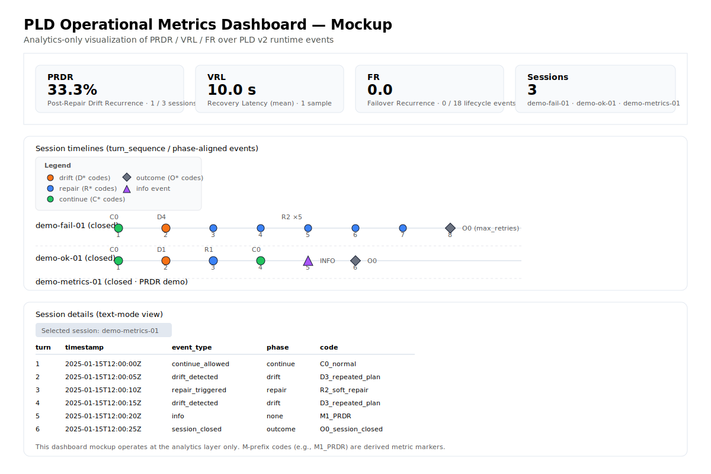

# Phase Loop Dynamics™ (PLD)

[](LICENSE)
[](LICENSE)


*A Runtime Phase Model for Stable LLM Agent Execution*
(Across Short and Multi-Turn Interactions)

---

## 🔎 What is PLD

**Phase Loop Dynamics (PLD)** is a behavioral stability layer for multi-turn LLM systems.  
It formalizes how systems **detect instability, attempt correction, verify recovery,  
and resume execution** across long reasoning sequences.

> **Single responses measure quality.  
> PLD measures stability across turns.**

This repository contains **specifications, runtime components, examples, adoption resources, and evaluation patterns.**

---

## 🧭 Start Here Based on Your Role

| You Are…                           | Recommended Entry Point                                                                                           |
| ---------------------------------- | ----------------------------------------------------------------------------------------------------------------- |
| 🧑‍💻 **Developer / Engineer**     | `quickstart/` → run `easy_pld_demo.py` for a concise high-level usage flow |
| 🧪 **Researcher / Architect**      | `docs/` (Levels 1–3) → semantics, schema, taxonomy, runtime reasoning |
| 🧑‍💼 **Product / Decision Maker** | `pitch/` → understand why multi-turn systems fail and how PLD stabilizes them |
| 🧭 **Evaluating or Integrating**   | `examples/` and `analytics/` for patterns, metrics, and observational workflows |
| 🤝 **Partner / Biz stakeholder preparing a PoC** | `governance/PLD_business_overview.md` and `governance/PoC_kickoff_guide.md` |

---

## ⚠️ Repository Maturity & Governance Model

> **Status: Candidate — actively evolving.  
> Behavioral patterns, taxonomy, and runtime conventions may continue to evolve based on implementation feedback.**

Community feedback and field reports are encouraged.

---

## 🛑 Scope of This Repository

PLD follows a **Standard-First** philosophy, similar to protocols such as OpenTelemetry, OAuth, or Matrix.

### This Repository **IS:**

* **A Governance Standard:** Defining the logic and lifecycle of Drift → Repair → Reentry (Levels 1–3).
* **A Reference Implementation:** Minimal runtime (`pld_runtime/`) to validate the specification.
* **A Behavioral Contract:** Ensuring alignment across agents, frameworks, and evaluation pipelines.

### This Repository **IS NOT:**

* ❌ A production SDK or turnkey agent framework
* ❌ A batteries-included AI runtime with ecosystem integrations
* ❌ A replacement for LangChain, LangGraph, Semantic Kernel, or AgentOps

Such layers belong in **Level 4+ ecosystem extensions** — not inside the core repository.

### 🧩 Where PLD Fits in the Agent Stack

PLD is a **behavioral stability layer** that observes and governs system dynamics across turns.

```
┌───────────────────────────────────────────────┐
│ Application Logic / Domain Tools / UX        │
└───────────────────────────────────────────────┘
                      ▲
        ┌─────────────────────────────────┐
        │      **PLD Runtime Layer**      │
        │   (Behavioral Governance)       │
        └─────────────────────────────────┘
                      ▼
┌───────────────────────────────────────────────┐
│ LangGraph | Assistants API | Rasa | AgentOps │
└───────────────────────────────────────────────┘
                      ▼
                Foundation Models
```

| Area                              | Owned by PLD? | Owner                       |
| --------------------------------- | ------------- | --------------------------- |
| Model inference                   | ❌             | Foundation model            |
| Tool execution                    | ❌             | Agent / orchestrator        |
| Memory strategy                   | ❌             | Framework or design pattern |
| Behavioral stability across turns | ✔             | **PLD Runtime Layer**       |

PLD can be **added, removed, or run in observer-mode** without altering existing business logic.

```
If your agent already works — PLD helps it stay stable.
If your agent drifts — PLD makes the drift visible and recoverable.
```

---

### Maintainer Role & Change Boundary

The maintainer functions primarily as:

1. **Semantic Steward** — preserving the conceptual integrity of Drift/Repair semantics
2. **Schema Governor** — maintaining Levels 1–3 as stable, versioned specification assets

> **Contributors Welcome:**
> Community contributions are encouraged — especially **Level-4 adapters**
> (e.g., LangGraph nodes, RAG controllers, Semantic Kernel plug-ins, tracing exporters).

---

## 🎯 Why PLD Exists

> Multi-turn agents rarely fail because they *don't know something*—  
> they fail because behavior becomes **unstable over time**.

Common patterns include:

* repeated tool calls without progress
* hallucinated or unstable context
* behavior shifts across models
* drift that temporarily recovers, then returns

PLD introduces a runtime behavioral contract:

```
Drift → Repair → Reentry → Continue → Outcome
```

This ensures alignment persists across turns — not just per isolated response.

---

## 🔁 The Runtime Loop

| Phase        | Purpose                    | Example Signals                     |
| ------------ | -------------------------- | ----------------------------------- |
| **Drift**    | Detect misalignment        | contradiction, tool failure         |
| **Repair**   | Soft → hard correction     | clarification, boundary restatement |
| **Reentry**  | Confirm alignment restored | checkpoint summary                  |
| **Continue** | Resume execution           | next valid step                     |
| **Outcome**  | End state                  | complete / partial / failed         |

Visual summary:


---

### ⚡ Runtime Modes: Observer vs. Governor

You can deploy PLD in two architectural modes depending on your performance requirements:

* **👀 Observer Mode (Async)**
    * **Impact:** **0ms Latency** (Fire-and-forget).
    * **Mechanism:** PLD operates parallel to the user response.
    * **Use Case:** Monitoring, Analytics, Post-incident analysis.

* **🛡️ Governor Mode (Sync)**
    * **Impact:** Intercepts & blocks actions before execution.
    * **Mechanism:** PLD acts as a gatekeeper for high-risk actions.
    * **Use Case:** Safety enforcement, Budget control, Autonomous agents.

👉 *See [`/docs/architecture/runtime_modes.md`](/docs/architecture/runtime_modes.md)*

---

### 🛡️ Supported Repair Strategies

PLD defines three authoritative patterns for fixing drift, allowing you to balance latency vs. safety:

| Strategy | Mechanism | Best For |
| :--- | :--- | :--- |
| **Static Repair** | Rule-based / Regex fix | Schema errors (Zero latency) |
| **Guided Repair** | LLM Self-Correction | Context/Tone drift |
| **Human-in-the-Loop** | Governance Escalation | High-stakes financial ops |

👉 *See [`/docs/concepts/03_repair_strategies.md`](/docs/concepts/03_repair_strategies.md)*

---

### 🧪 Minimal Example: The Repair Loop in Action

A micro-scale real-world example showing how PLD governs behavior:

```jsonc
// 1️⃣ Agent attempts API call — "parking" is missing
{"event_type": "info", "log_class": "tool_call_attempt", "pld_event": false,
 "payload": {"args": {"amenities": ["wifi"]}}}  // ⚠️ parking omitted

// 2️⃣ PLD detects violation (drift)
{"event_type": "drift_detected", "phase": "drift", "pld_event": true,
 "payload": {"status": "VIOLATION", "missing_constraints": ["parking"]}}

// 3️⃣ PLD blocks continuation (paired with continue_allowed later)
{"event_type": "continue_blocked", "phase": "continue", "pld_event": true,
 "payload": {"block_reason_code": "MANDATORY_CONSTRAINT_OMISSION"}}

// 4️⃣ PLD triggers repair (soft repair pattern)
{"event_type": "repair_triggered", "phase": "repair", "pld_event": true,
 "payload": {"repair_code": "soft_repair_triggered",
             "repair_context": {"missing_constraint": "parking"}}}

// 5️⃣ Agent retries with fix
{"event_type": "info", "log_class": "tool_call_attempt", "pld_event": false,
 "payload": {"args": {"amenities": ["wifi", "parking"]}}}  // ✅ Fixed

// 6️⃣ PLD evaluates and passes (reentry check)
{"event_type": "evaluation_pass", "phase": "outcome", "pld_event": true,
 "payload": {"check_kind": "drift_check", "status": "PASS"}}

// 7️⃣ PLD allows continuation (completion of repair loop)
{"event_type": "continue_allowed", "phase": "continue", "pld_event": true,
 "payload": {"approved_call_id": "call_2a3b4c5d"}}
```

| Stage                 | Before PLD              | After PLD                          |
| --------------------- | ----------------------- | ---------------------------------- |
| Tool call             | `"amenities": ["wifi"]` | `"amenities": ["wifi", "parking"]` |
| Phase                 | `drift → repair`        | `reentry → continue`               |
| User intent alignment | ❌ broken                | ✅ restored                         |

see `examples/reference_traces`

> This demonstrates the full PLD loop:  
> **Agent attempt** → **Drift detected** → **Repair** → **Verification** → **Resume**

---

## ⚡ Quickstart — Run PLD in Under 10 Seconds

> **⚠️ Note on Running Scripts**
> Always run scripts from the **repository root directory** (where this README is located) to ensure `pld_runtime` is importable.
>
> ✅ `python quickstart/easy_pld_demo.py`
> ❌ `cd quickstart && python easy_pld_demo.py`

```bash
python quickstart/easy_pld_demo.py      # Recommended: simplest demo using SimpleObserver
python quickstart/hello_pld_runtime.py  # Schema-compliance drift detection demo
python quickstart/run_minimal_engine.py # Multi-turn runtime loop example
python quickstart/metrics_quickcheck/verify_metrics_local.py  # Validate PLD metrics
```

Next steps → `quickstart/README_quickstart.md`

### 🚀 Quickstart Scripts Guide
* **`easy_pld_demo.py`:** Easiest entry point. Shows the "3-line integration" pattern.
* **`hello_pld_runtime.py`:** Demonstrates built-in schema drift detection (e.g., missing keys).
* **`run_minimal_engine.py`:** Runs a multi-turn simulation to show the full phase loop.

From quickstart/easy_pld_demo.py
### ⚡ Integrate PLD in 3 lines:  

from pld_runtime import SimpleObserver  

1. Wrap your agent (Observer Mode)  
pld = SimpleObserver(agent_name="my_agent")  

2. Log interaction  
pld.log_turn(user_input="...", agent_output="...")  

3. Check for drift (Automatic)  
-> Events are emitted to .jsonl automatically  

<details>
<summary>🧪 Built-In Runtime Detectors (Experimental)</summary>

PLD Runtime includes **Level-5 built-in detectors**, allowing you to experience drift detection in Quickstart without writing custom detection logic.

Current experimental detectors (see `pld_runtime/detection/builtin_detectors.py`):

| Detector                   | Purpose                                                   | Typical Taxonomy Code |
| -------------------------- | --------------------------------------------------------- | --------------------- |
| `SimpleKeywordDetector`    | Detect mismatched or harmful instruction patterns in text | `D1_instruction`      |
| `SchemaComplianceDetector` | Ensure required keys exist in structured payloads         | `D2_context`          |

These detectors:

* Extend the `DriftDetector` template from `pld_runtime/detection/drift_detector.py`.
* Emit PLD-compliant `drift_detected` events with `phase = "drift"` and `D*`-family codes.
* Do **not** modify Level 1–3 semantics — they operate purely as Level-5 runtime components.

</details>

---

## 🏛 Architecture: The PLD Level Model

| Level                  | Meaning                            | Folder                                    |
| ---------------------- | ---------------------------------- | ----------------------------------------- |
| **1 — Structure**      | Canonical schema (Hard Invariants) | `/docs/specifications/level_1_schema/`    |
| **2 — Semantics**      | Event meaning & matrix rules       | `/docs/specifications/level_2_semantics/` |
| **3 — Standards**      | Operational metrics & taxonomy     | `/docs/specifications/level_3_standards/` |
| **4 — Implementation** | Runtime design & Patterns          | `/docs/architecture/` & `/docs/patterns/` |
| **5 — Runtime**        | Reference Python Engine            | `/pld_runtime/`                           |

---

## 📂 Repository Guide

```
quickstart/     → start here (code, demos, and built-in drift detectors)
pld_runtime/    → runtime reference implementation
docs/           → specifications (L1-3) & architecture (L4-5)
analytics/      → evaluation datasets & reports
governance/     → collaboration, roles, and PoC protocols
```

Full structure → `SUMMARY.md`

---

## 📈 Observability

Once structured events flow, the system becomes measurable:



* **PRDR — Post-Repair Drift Recurrence**
* **VRL — Visible Repair Load**
* **FR — Failover Rate**

Metrics cookbook → `docs/metrics/pld_operational_metrics_cookbook.md`

#### Text-based Metrics Dashboard (Experimental)

A minimal console dashboard is available at `examples/dashboard/app.py`.  
A sample CLI metrics summary output is available in  
`examples/dashboard/metrics_cli_summary_demo.txt`.  

Usage:

```bash
python examples/dashboard/app.py                              # Use demo events file
python examples/dashboard/app.py --file path/to/events.jsonl  # Custom log file
python examples/dashboard/app.py --no-sessions                # Metrics summary only
```

---

## 🧪 PLD is most useful when:

PLD is most useful when:

✔ an interaction involves multiple execution steps or retries  
  (e.g., tool calls, retrieval, validation, correction)  

✔ state or intent must remain consistent across those steps  
  — even within a single user session  

✔ failures are detected and corrected during execution,  
  not only after a response is returned  

Less relevant for:  
⚠ single-shot Q&A with no intermediate state  
⚠ fully deterministic scripted flows

---

## 🔌 Integrations

Compatible with:

* LangGraph
* Assistants API
* Rasa
* Swarm
* Custom orchestration

Vendor-neutral — only a runtime behavioral contract.

**Observer-Mode Integration Example (Experimental)**  
A minimal reference integration is available under `examples/langgraph_assistants/`.

```bash
export OPENAI_API_KEY=your_key_here
python examples/langgraph_assistants/run.py
# Logs: logs/langgraph_pld_demo.jsonl
```

---

## 📁 Collaboration & PoC Starter Materials

If you are preparing a shared Proof-of-Concept (PoC) or collaborating with partner organizations,  
the **`governance/`** folder provides business-friendly materials to help teams begin quickly and stay aligned.

Recommended entry points:

| Purpose | File |
|--------|------|
| 1-page business introduction | `governance/PLD_business_overview.md` |
| PoC kickoff guide (Biz-friendly) | `governance/PoC_kickoff_guide.md` |
| Lightweight templates (scope, session review sheet, submission format) | `governance/starter_kit/` |

These resources enable both sides to:

- agree on scope and expectations  
- collect 5–10 representative sessions  
- run the first joint review using consistent terminology  
- collaborate without requiring PLD technical expertise

Use these materials when beginning a PoC, onboarding partners, or aligning multi-team PLD adoption.

---

## 🗂 Practitioner Resources

### Vocabulary Mapping

Practitioners often describe failures using informal terms such as:

- "wobble"
- "going off-track"
- "slow degradation"
- "looping"
- "bad tool call"

PLD describes the same phenomena with formal lifecycle terminology.

A complete **practitioner ↔ PLD vocabulary mapping** is available here:

📄 [Practitioner_Vocabulary_Mapping_Guide.md](./Practitioner_Vocabulary_Mapping_Guide.md)

Use this guide when interpreting PLD metrics, trace patterns, or stability reports.

### Companion Repository (PLD-Free Explanation)

If you prefer explanations of instability phenomena **without PLD terminology**  
(e.g., *early instability signals*, *trace divergence*, *post-correction relapse*, *latency gaps*),  
see the companion repository:

👉 **https://github.com/kiyoshisasano/agent-instability-notes**

This companion repo is ideal for engineers, observability teams, and applied ML practitioners  
who want to understand the behavioral ideas before adopting PLD's formal vocabulary.

---

## 🌱 Community & Support

PLD is actively evolving, and real-world usage and shared traces play a key role in refinement.

* 📣 Discussions: [GitHub Discussions](https://github.com/kiyoshisasano/agent-pld-metrics/discussions)
* 🐛 Issues: [GitHub Issues](https://github.com/kiyoshisasano/agent-pld-metrics/issues)

⭐ Want to contribute? Look for **"good first issue"** labels or start a discussion.  
Even small contributions (examples, tests, docs, traces) are valuable.

See: `CONTRIBUTING.md`

---

## 📌 Project Information

### Current Phase

This repository is currently in an **Exploratory / Candidate Stage**.  
Components may evolve based on evaluation, implementation feedback, and research findings.

### License & Attribution

| Scope                       | License    |
| --------------------------- | ---------- |
| Runtime & code              | Apache 2.0 |
| Documentation & methodology | CC BY‑4.0  |

Full details: `LICENSES/OVERVIEW.md`

### Trademark Statement

"Phase Loop Dynamics" and "PLD" are names and identifiers associated with the work of **Kiyoshi Sasano** and are treated as common-law trademarks.  
➡ `LICENSES/TRADEMARK_POLICY.md`

### Maintainer

**Maintainer:** Kiyoshi Sasano  
© 2025 — All rights reserved where applicable.

---

> **PLD is behavioral infrastructure —
> it ensures alignment persists *across interaction*,
> not just at initialization.**
