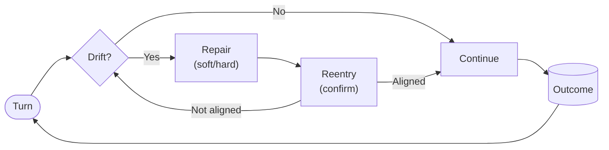

# Phase Loop Dynamics™ (PLD) 
*A Runtime Phase Model for Stable Multi-Turn LLM Systems*


> PLD is not a framework or agent library.  
> It is a runtime governance model for stabilizing multi-turn agents across turns, tools, models, and environments.

---

## 🎯 Is This For You?

PLD becomes relevant when you're building **multi-turn agents** and begin seeing patterns that don’t feel random — but don’t feel controllable.

You may be here because your system:

- 🔧 Works in controlled tests, but behaves **unpredictably** in real usage  
- 🔁 Repeats tool calls or re-enters retry loops without meaningful progress  
- 🧩 Recovers from drift once — then misaligns later  
- 🔄 Breaks when switching models (GPT → Claude → Llama) despite identical logic  
- 🤷 Feels “stable only when untouched,” requiring intuition rather than governance  

In other words:

> **Your agent works — but not reliably, explainably, or repeatably.**

As systems scale, drift stops being exceptional —  
it becomes a predictable characteristic of multi-turn autonomy.  
If your roadmap includes model migration, orchestration, or autonomous decision routing,  
PLD shifts from **"helpful"** to **infrastructure**.

PLD gives you the missing layer:  
a runtime behavioral contract that maintains alignment **across turns — not just per response.**

👉 **If your system *almost works*, you're entering the stage where structured governance becomes necessary.**

---

## 🧠 Why PLD Exists — 10-Second Summary

Modern multi-turn LLM agents rarely fail because of knowledge gaps —  
they fail because alignment **drifts over time**.

PLD introduces a **runtime control loop** that:

- Detects drift early  
- Repairs behavior  
- Confirms alignment before continuing  

```
Drift → Repair → Reentry → Continue → Outcome
```

---

### 📍 High-Level Runtime Model (Visual Summary)

> A compact view of the runtime loop, metrics integration, and conceptual role of PLD.


---

## 🧩 What PLD *Is* — In 30 Seconds


PLD is:

- A **runtime phase model** for interaction stability  
- A structured method for **drift detection and repair**
- A **behavioral governance layer**, not a model prompt or product
- **Observable and measurable** — compatible with telemetry and evaluation
- Implementation-agnostic: works with tool agents, retrieval systems, planners, and chat models  

> PLD governs **how behavior evolves over turns**, not how a single output is generated.

---

## 🚀 Who Uses PLD

| Role | Value |
|------|-------|
| **LLM / Agent Engineers** | Reduced cascade errors, fewer resets |
| **Interaction & UX Designers** | Predictable repair and alignment signaling |
| **AgentOps & Evaluation Teams** | Observable behavioral diagnostics and metrics |

---

## 🧭 The PLD Runtime Loop

| Phase | Purpose | Signals |
|-------|---------|---------|
| **Drift** | Detect divergence from task or shared reality | tool errors, contradiction, missing context |
| **Repair** | Soft/hard correction | clarification, reset, constraint restatement |
| **Reentry** | Confirm restored alignment | checkpoint, summarization |
| **Continue** | Resume execution | next step |
| **Outcome** | End state | complete / partial / failed / abandoned |

> Framework-agnostic: supports LangGraph, Assistants API, AutoGen, Swarm, Rasa, or custom orchestrators.

---

## 📈 Runtime Model Diagram



Full reference: `/docs/model_diagram.md`

---

## 🆚 Before vs After PLD

| Without PLD | With PLD |
|-------------|----------|
| Silent brittle failures | Explicit repair and confirmation |
| Repeated invalid tool calls | Controlled retry + fallback |
| Lost context | Structured reentry checkpoints |
| Unpredictable user experience | Observable, governable behavior |

---

### 🏗 Optional: Architectural Perspective

📄 `/docs/architecture_layers.md`  
A higher-level view for teams mapping PLD into large orchestration stacks.

---

### 🏁 Quickstart — Run PLD in Under 10 Seconds

Before diving into the full documentation, you can **experience PLD behavior immediately**.

PLD is a telemetry-first paradigm.

Every turn produces measurable behavioral events aligned to:

- `quickstart/metrics/schemas/pld_event.schema.json`
- `quickstart/metrics/schemas/metrics_schema.yaml`

This enables governance not by intuition — but by data.


#### Step 1 — Run the Teaching Runtime (Recommended First)

```bash
python quickstart/hello_pld_runtime.py
```

Try custom input:
```bash
python quickstart/hello_pld_runtime.py "Can we switch topics and talk about cooking?"
```

Run all example scenarios:
```bash
python quickstart/hello_pld_runtime.py --examples
```

> PLD is best understood through interaction — not just by reading.
> This script demonstrates the core runtime loop:
> Drift → Repair → Reentry → Continue → Outcome
> (in a minimal mock runtime environment)

---

#### Step 2 — Run the Real Runtime Engine

Once the lifecycle makes sense conceptually, you can execute the actual runtime controller:

```bash
python quickstart/run_minimal_engine.py
```

- Uses real ingestion, controller, and enforcement logic

- Simulates a drift condition (e.g., empty RAG result)

- Outputs policy decisions, trace IDs, and next-action recommendations

> 🛠️ This verifies PLD is installed and running as a real runtime, not just a conceptual demonstration.

---

#### 📊 Optional Step — Verify Metrics Locally
Once you've run the runtime and seen PLD behavior,
you can also measure it using the included demo dataset:
```bash
python quickstart/metrics/verify_metrics_local.py
```

- This will calculate sample operational metrics such as:
- PRDR — Post-Repair Drift Recurrence
- VRL — Visible Repair Load
- MRBF — Mean Repairs Before Failover
- FR — Failover Rate

➡ Detailed guide: `quickstart/metrics/README_metrics.md`

---
 
For deeper usage patterns, continue with:  
➡️` quickstart/README_quickstart.md` 

---

### 📊 Operational Dashboard (Preview)

Once PLD is running and metrics are emitted, the system becomes observable — not just executable.

<p align="center">
  
</p>

> This dashboard represents the **end-state goal**: a stable monitoring layer that makes system behavior measurable and governable — not assumed.

This visualization corresponds to the five operational metrics defined in:

➡ `docs/07_pld_operational_metrics_cookbook.md`

| Metric | What it answers |
|--------|----------------|
| **PRDR** | Do repairs *stick*, or does drift recur? |
| **REI** | Are repairs *worth the cost*? |
| **VRL** | Does the system *feel stable* to users? |
| **FR** | How often does the system reach failure fallback? |
| **MRBF** | How long does the system try before giving up? |

PLD is designed as a closed feedback loop:

Runtime → Logging → Metrics → Dashboard → Policy Adjustment → Improved Behavior → Runtime

---

#### When this dashboard becomes useful

| Stage | Value |
|-------|-------|
| **Early prototyping** | Optional — behavior is still unpredictable |
| **Beta rollout (10–200 users)** | 🔥 Most value — detects convergence vs fragility |
| **Production** | Used for regression tracking and release gating |
| **Mature system** | Moves from real-time monitoring → weekly health check |

> The goal is not to chase perfect metrics —  
> but to **make runtime behavior visible, measurable, and governable.**

---


## 📂 Repository Overview

```
/quickstart     — Learning path + implementation patterns (start here)
/pld_runtime    — Reference runtime (optional)
/docs           — Taxonomy, conceptual model, reference material
/analytics      — Benchmark datasets + case studies
/field          — Collaboration playbooks and adoption patterns
```

➡ Full structure: `/docs/repo_structure.md`

---

## 📏 Operational Metrics

Once PLD is active in a system, evaluation may include:

- Drift frequency
- Repair efficiency (soft vs hard)
- Reentry confirmation success
- Stability vs latency trade-offs
- Outcome completion distribution

Full operational framework including PRDR, REI, VRL and evaluation workflow:  
👉 `/docs/07_pld_operational_metrics_cookbook.md`

---

## 🧪 Practical Adoption Path

| Step | Folder | Purpose |
|------|--------|---------|
| **1** | `/quickstart/overview/` | Understand the runtime loop |
| **2** | `/quickstart/operator_primitives/` | Apply operator logic |
| **3** | `/quickstart/patterns/` | Modular behavior patterns |
| **4** | `/quickstart/patterns/04_integration_recipes/` | **Runnable reference examples** |
| **5** | `/quickstart/metrics/` | Log drift → repair → reentry → outcome |
| **6** | `/analytics/` | Compare results against evaluated traces |
| **7** | `/docs/07_pld_operational_metrics_cookbook.md` | Apply runtime metrics to optimize repairs and stability |

---

### 🧩 Runnable Integration Recipes

```
quickstart/patterns/04_integration_recipes/
```

These reference examples are:

| Property | Meaning |
|----------|---------|
| 🧪 Runnable | Executable locally (no infra required) |
| 🔍 Observable | Emits structured PLD signals |
| 📈 Measurable | Compatible with metrics cookbook |
| 🧱 Modular | Works with memory, tools, or RAG systems |

---

### ▶ Minimal Conceptual Example

This illustrates the phase loop logic — not a runnable implementation.

```python
# Conceptual pseudo-implementation

phase = detect_drift(turn)

if phase is DRIFT:
    turn = repair(turn)
    phase = REPAIR

if phase is REPAIR:
    if confirm_alignment(turn):
        phase = CONTINUE
    else:
        phase = DRIFT
```

> Actual implementation depends on the orchestration environment.

---

## 📊 Evidence Layer

Validated through:

- MultiWOZ 2.4 (200 annotated dialogs)
- Real tool-enabled agents
- Applied SaaS support case studies
- Field PoCs

See: `/analytics/`

---

## 🔌 Integrations

Compatible with:

- LangGraph
- Assistants API
- Swarm
- Rasa
- ReAct-style planners
- Custom orchestration pipelines

No required framework — only the **loop semantics**.

---

## 🤝 Contribution & Collaboration

Contributions are welcome, especially:

- Runtime bridges and adapters  
- Evaluation datasets and traces  
- Operational repair heuristics  
- Metrics dashboards  

For shared PoCs or partnership work → see `/field/`.

---

## 📍 When PLD Applies

Best suited when:

✔ Multi-turn workflows  
✔ Tools, retrieval, memory, or planning  
✔ Recovery matters more than one-shot accuracy  

Less relevant when:

⚠ Single-turn answers  
⚠ Fully deterministic scripted flows  

---

---

## 🧭 Metadata & Manifest System (How Components Are Described)

PLD is designed for collaboration — especially in environments where multiple teams,
implementations, or runtime modules evolve over time.

To support this, the repository includes a lightweight metadata system that makes
components **discoverable, traceable, and machine-checkable** without restricting experimentation.

This system consists of three parts:

| Purpose                             | File                             |
| ----------------------------------- | -------------------------------- |
| Specification (the rules)           | `meta/METADATA_MANIFEST_SPEC.md` |
| Reference example                   | `meta/manifest.example.yaml`     |
| Active metadata for this repository | `manifest.yaml`                  |

The manifest format is intentionally simple and may evolve as integrations and
field usage mature.

---

### 📦 What Belongs in the Manifest?

Any artifact that participates in runtime behavior, evaluation, documentation,
or integration can be listed in the manifest — including:

* runtime modules
* schemas and metrics
* documentation assets
* examples and learning paths
* experimental work

Each entry includes:

* a stable `component_id`
* controlled vocabulary fields (`kind`, `status`, `authority_level`)
* a short human-readable purpose

Full details: `meta/METADATA_MANIFEST_SPEC.md`.

---

### 🛠 Validating the Manifest

A helper script is included for contributors and teams automating runtime governance.

```bash
python validate_manifest.py
```

Validation levels:

| Level | Meaning                                               |
| ----- | ----------------------------------------------------- |
| `L0`  | Structural only — useful for exploration              |
| `L1`  | Format + vocabulary enforcement (default)             |
| `L2`  | File existence + optional alignment with code headers |

Example:

```bash
python validate_manifest.py --level L2
```

This allows gradual adoption — from prototype → controlled collaboration → automated CI enforcement.

---

### 🤝 Contributing Metadata

When adding new runtime files, documents, or integration artifacts:

1. Add or update an entry in `manifest.yaml`
2. Run the validator:

```bash
python validate_manifest.py --level L1
```

3. Commit changes as part of the same PR.

> Metadata is not bureaucracy — it is a map.
> It helps others understand *what exists*, *why it exists*, and *how stable it is.*

---


## 📜 License

This project uses a dual-license model:

| Scope | License |
|--------|---------|
| Runtime and code | Apache 2.0 |
| Documentation and methodology | CC BY 4.0 |  

Full details: `LICENSES/LICENSES.md`  
Trademark usage: `LICENSES/TRADEMARK_POLICY.md`

For enterprise licensing or collaboration:  
📩 deepzenspace[at]gmail.com

---

"Phase Loop Dynamics" and "PLD" are claimed as common law trademarks of Kiyoshi Sasano.  
Use of the marks is governed by the project's trademark policy.

Maintainer: **Kiyoshi Sasano** Copyright © 2025

---

> **PLD is behavioral infrastructure —  
it ensures alignment persists *across interaction*,  
not just at initialization.**
