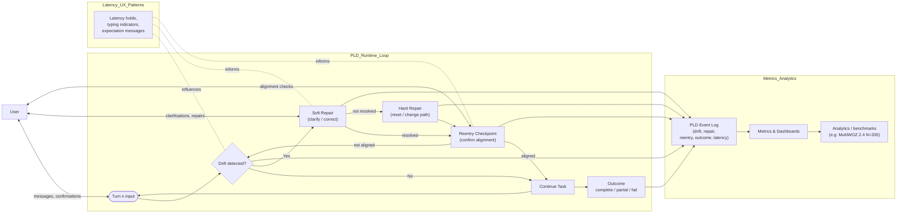

```mermaid
flowchart LR
    %% === User Side ===
    U[User]

    %% === PLD Runtime Loop ===
    subgraph PLD_Runtime_Loop
        Start([Turn n input])
        Drift{Drift detected?}
        Soft["Soft Repair\n(clarify / correct)"]
        Hard["Hard Repair\n(reset / change path)"]
        Reentry["Reentry Checkpoint\n(confirm alignment)"]
        Continue[Continue Task]
        Outcome["Outcome\ncomplete / partial / fail"]
    end

    %% === UX & Latency Layer ===
    subgraph Latency_UX_Patterns
        Latency["Latency holds,\ntyping indicators,\nexpectation messages"]
    end

    %% === Metrics & Analytics Layer ===
    subgraph Metrics_Analytics
        Log["PLD Event Log\n(drift, repair,\nreentry, outcome, latency)"]
        Metrics[Metrics & Dashboards]
        Bench["Analytics / benchmarks\n(e.g. MultiWOZ 2.4 N=200)"]
    end

    %% --- User ↔ Runtime ---
    U <-->|messages, confirmations| Start
    U <-->|clarifications, repairs| Soft
    U <-->|alignment checks| Reentry

    %% --- Core Runtime Flow ---
    Start --> Drift
    Drift -->|No| Continue
    Drift -->|Yes| Soft
    Soft -->|resolved| Reentry
    Soft -->|not resolved| Hard
    Hard --> Reentry
    Reentry -->|aligned| Continue
    Reentry -->|not aligned| Drift
    Continue --> Outcome
    Continue --> Start

    %% --- Latency & UX influence ---
    Latency -. influences .- Drift
    Latency -. informs .- Soft
    Latency -. informs .- Reentry

    %% --- Logging & Evaluation ---
    Drift --> Log
    Soft --> Log
    Hard --> Log
    Reentry --> Log
    Outcome --> Log

    Log --> Metrics --> Bench

```
