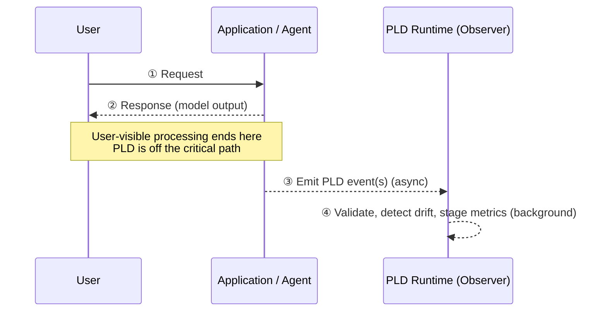
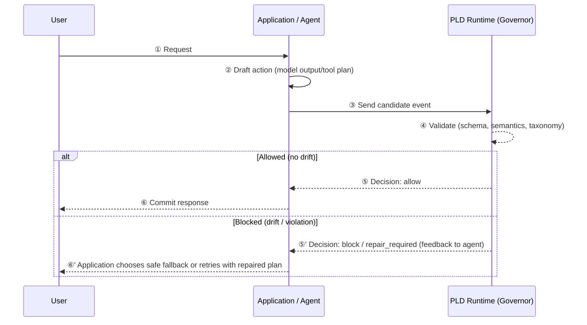

# PLD Runtime Modes: Observer vs Governor

Status: Informative / Non-normative
Layer: Docs / Architecture

---

## 0. Overview

This document describes **two runtime architectural modes** for integrating the PLD (Predictive Lifecycle Drift) runtime into an application:

* **Observer Mode (Async)** — Non-blocking, fire-and-forget PLD processing
* **Governor Mode (Sync)** — Blocking, gatekeeping PLD processing

These modes **do not modify PLD Level 1–3 specifications** (schema, semantics, taxonomy). They instead describe **how a Level 5 PLD runtime controller is positioned in an application's architecture**.

---

## 1. Background: Why Runtime Modes?

A common concern when integrating PLD is:

> "Will PLD add latency to user-visible responses?"

This depends entirely on **where** the runtime controller is placed in the application architecture. Therefore PLD supports two deployment patterns:

1. **Observer Mode (Async):** Zero added latency on the user-critical path
2. **Governor Mode (Sync):** PLD decisions gate application actions

This document illustrates both patterns and explains their differences.

---

## 2. Runtime Modes at a Glance

| Mode                 | Latency Impact (User Path)          | PLD Positioning                 | Drift Detection Effect       | Typical Use Case                         |
| -------------------- | ----------------------------------- | ------------------------------- | ---------------------------- | ---------------------------------------- |
| **Observer (Async)** | ~0ms                                | Side-channel / logging pipeline | Recorded, not blocked        | Early deployment, monitoring, evaluation |
| **Governor (Sync)**  | Added latency (PLD validation cost) | Inline gatekeeper               | Block / repair before action | Safety-critical flows, tool execution    |

Both modes use the same PLD event schema and runtime components (RuntimeSignalBridge, PldController, metrics engine) but connect them differently.

---

## 3. Observer Mode (Async)

### 3.1 Definition

**Observer Mode** is a non-blocking PLD integration pattern where:

* The application returns responses to the user immediately.
* PLD event building, validation, and drift detection run **out-of-band**.
* Drift does *not* affect the **immediate** user-visible response path.

This mode provides **zero added latency** to the user for the request/response currently in flight.

In the default form described here, Observer Mode is *read-only* with respect to the application’s live control flow: PLD detects and records drift but does not synchronously change agent state before the response is sent. Implementations MAY still use PLD findings to update memory, configuration, or policies **asynchronously** so that later turns can benefit from drift signals.

### 3.2 Sequence Diagram (Observer Mode)

### 3.3 Architectural Characteristics

* PLD runtime consumes events from logs/queues.
* `PldController.validate_event` runs offline or in a background worker.
* Suitable for deployments where PLD data is used for:

  * monitoring,
  * debugging,
  * drift analytics,
  * offline evaluation.

Observer Mode is the recommended starting point for most integrations.

### 3.4 State Feedback in Observer Mode (Optional)

Observer Mode can be deployed in two patterns:

* **Strict Read-Only Observer**
  PLD runtime writes only to logs and metrics. It does not write back into agent memory or policies. Drift is acted on by humans or offline processes.

* **Async Feedback Observer**
  PLD runtime remains off the critical path for user responses, but a background worker uses drift signals to adjust agent memory, flags, or configuration for future turns (for example, marking a conversation as “needs clarification” before the next user message).

In both cases, the current turn’s response is not blocked by PLD; only future behavior may change, and only via application-defined mechanisms outside the PLD schema and semantics.

---

## 4. Governor Mode (Sync)

### 4.1 Definition

**Governor Mode** is a synchronous PLD integration pattern where:

* Application actions (model outputs, tool calls, plans) are **intercepted**.
* PLD validation must succeed before the action is committed.
* Drift or policy violations may block or trigger repair flows.

This mode introduces **some added latency** equal to the PLD controller’s validation cost.

### 4.2 Sequence Diagram (Governor Mode)

### 4.3 Architectural Characteristics

* PLD sits **inline** on the request path.
* Used when actions must be verified for safety/consistency.
* Common patterns:

  * Block unsafe tool invocations
  * Intercept instructions with detected drift
  * Trigger repair or clarification flows

Governor Mode trades latency for stronger control.

### 4.4 Unknown / Error Decisions and Fail-Open vs Fail-Closed

Governor Mode integrations SHOULD explicitly decide how to behave when the PLD validation stack cannot produce a clear **allow** or **block** decision (for example, due to timeouts or internal errors in semantic validators):

* **Fail Closed (safety-first):** treat indeterminate results as “block” and route to a safe fallback.
* **Fail Open (availability-first):** treat indeterminate results as “allow” and proceed, potentially logging an incident.

This document does not prescribe one policy globally. Instead, implementers SHOULD choose per environment or per action category (for example, fail closed for high-risk tools, fail open for low-risk chat-only flows) and document that choice alongside the controller profile.

---

## 5. Relationship to `pld_runtime/05_controllers`

PLD runtime modes are not part of the PLD schema or event semantics. Instead, they are **architectural choices** that determine **where** the `PldController` is placed.

### 5.1 Observer Mode

* `PldController` operates **off the critical path**.
* Validity results influence monitoring, not user-facing responses.
* Typical wiring:

  * `RuntimeSignalBridge` → `StructuredLogger` → log/queue → background workers
  * Background worker: `PldController.validate_event`

### 5.2 Governor Mode

* `PldController` runs **in the request pipeline**.
* Controller decisions directly shape application behavior.
* Typical wiring:

  * draft action → `RuntimeSignalBridge.build_event` → `PldController.validate_event` → allow/block

### 5.3 Specification Integrity

Regardless of mode:

* Level 1 schema remains unchanged.
* Level 2 semantics and event matrix remain unchanged.
* Level 3 runtime standards remain unchanged.
* Only the **application’s integration topology** varies.

---

## 6. Migration Strategy

A recommended adoption flow:

### Step 1 — Observer Mode only

* Zero latency impact
* Gain visibility into drift and lifecycle patterns

### Step 2 — Partial Governor Mode

* Apply synchronous gating only to high-risk actions (as defined by an application-level policy layer)

Examples of “high-risk” routing policies include:

* Application code that calls the PLD controller synchronously only for specific tools, APIs, or routes (for example, data export, code execution, payment operations).
* A policy layer in front of PLD that evaluates every action but treats clearly low-risk events as cheap, fast ALLOW while applying heavier validation only to flagged categories.

The definition of “high-risk” and the routing logic that decides which actions go through Governor Mode live outside the PLD schema and semantics; they are part of the application’s safety and risk policy.

### Step 3 — Full Governor Mode (optional)

* Expand gating to broader interaction flows based on observed data

This progressive approach avoids surprises and leverages PLD analytics to guide safer deployment.

---

## 7. Summary

* **Observer Mode** provides **non-blocking** PLD deployment with **zero added latency**.
* **Governor Mode** provides **gatekeeping**, aligning PLD validation to application actions.
* Both modes reuse the same Level 5 components but differ in **where the controller is placed**.

This document is informational and does not modify Level 1–3 PLD specifications.
