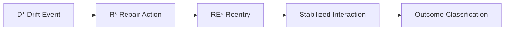

# 06 — PLD Concept Reference Map  
_For Applied AI Agent Engineers and Runtime System Designers_

Version: 1.0  
Maintainer: **Kiyoshi Sasano**

Standard Alignment:  
**Drift → Repair → Reentry → Resonance → Outcome**

---

## 1. Purpose

This document provides a **practical, engineering-focused reference map** for all core PLD concepts and how they connect in:

- Logging schemas  
- Evaluation pipelines  
- Runtime agent behavior  
- Tool execution and orchestration  
- UX pacing and fallback mechanisms  

It replaces early research-era conceptual maps and ensures:

> **All terms are operational, reusable, and machine interpretable.**

---

## 2. Core Concept Graph

This diagram shows how the PLD lifecycle flows during real interactions.



**Interpretation:**

- **Drift** begins the detection cycle.  
- **Repair** attempts correction.  
- **Reentry** determines whether the system returns to the task.  
- **Resonance** represents stabilization.  
- **Outcome** evaluates final success or failure.

This is not theory — it is the **runtime loop your agent executes**.

---

## 3. Vocabulary → Machine Mapping Table

| Concept | Human Meaning | Machine Namespace | Example Event |
|---------|---------------|------------------|---------------|
| Drift | The system diverges from expected task/state | `D*` | `D2_context` |
| Repair | How the system attempts to fix divergence | `R*` | `R1_clarify` |
| Reentry | Whether the workflow returns to the original intent | `RE*` | `RE3_auto` |
| Resonance | Stabilized behavior after repair | `resonance: true/false` | `true` |
| Outcome | Final completion state | `OUT*` | `OUT1_complete` |

---

## 4. Correct Usage Rules

### ✔ Allowed

- Use **only canonical labels**.
- Emit events in structured formats (`json`, `yaml`, dashboard metrics).
- Map tool failures and dialogue deviations to **Drift types**.
- Treat **repair** as a *decision*, not a generic retry.

### ❌ Not Allowed

- Invent new terminology.
- Use metaphors (e.g., *“lost rhythm”*, *“semantic drift cloud”*).
- Use raw “retry” without Repair classification.
- Log ambiguous terms (e.g., “fallback mode triggered”).

---

## 5. When Each Term Applies (Runtime Decision Guide)

| Situation | Correct Term |
|-----------|-------------|
| System misunderstood constraint | **Drift (D2 Context)** |
| System asks clarifying question | **Repair (R1 Clarify)** |
| System resumes original task after clarification | **Reentry (RE3 Auto)** |
| System stabilizes with consistent pacing and states | **Resonance = true** |
| Task completes successfully | **Outcome = OUT1 Complete** |
| Task fails or resets | **Outcome = OUT2 / OUT3** depending on context |

---

## 6. Anti-Patterns (Avoid These)

| Wrong Pattern | Problem | Correct Form |
|---------------|---------|--------------|
| “Retry after silence” | Unclassified recovery | Label: `D3_latency → R2_soft_repair` |
| “Response with no contradiction awareness” | Missing explicit drift acknowledgment | Use direct classification |
| “Hard reset without Drift detection” | Overuse of reset | Only after unrecoverable D5 |

---

## 7. Compliance Rules (LLM + Runtime)

These rules must be applied in:

- Prompt templates  
- Runtime supervisors  
- Schema validators  
- Observability dashboards  
- Auto-labeling pipelines  

```
✔ Always classify events as: Drift → Repair → Reentry → Outcome
✔ Use only machine-valid namespaces: D*, R*, RE*, OUT*
✔ Mark resonance only after ≥1 successful turn with no additional drift
✔ Never output legacy terminology
```

---

## 8. File Status

This file **replaces and succeeds**:

- `PLD_Lexicon_Connectivity_Map.md`
- all legacy lexicon lineage charts

It is now the **single authoritative Concept Map** for the PLD Applied edition.

---

Maintainer: **Kiyoshi Sasano**  