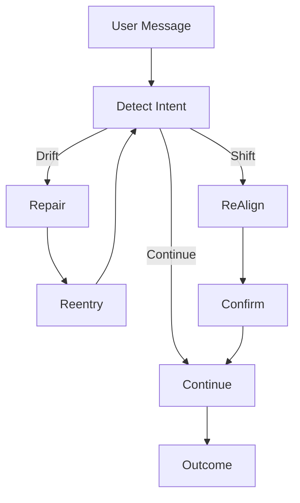

# ⚠️ READ FIRST — Experimental Extension (NOT PLD 1.0)

This document introduces a proposed extension to PLD.  
It is **NOT** part of the current **PLD 1.0 standard**, and:

- ❌ should **not** be implemented yet  
- ❌ is **not validated** in real-world PLD deployments  
- ❌ may be merged, redesigned, or discarded  
- ✔️ exists to **explore future direction and gather feedback**

If you're new to PLD:  
👉 **Ignore this document.**  
Use only the D-series taxonomy and Repair/Reentry loop.

Community review will determine whether this proposal becomes:

- an **extension of `D1_intent_drift` routing**  
- a **standalone taxonomy (`S*`)**  
- or **removed entirely**

---

# 1 — Purpose (Research Scope)

*This proposal explores whether PLD requires an additional classification layer to distinguish:*

| Type | Example | Current Handling | Issue |
|------|---------|------------------|-------|
| **Drift** | “No—that’s not what I meant.” | Repair → Reentry | Works well |
| **Shift** | “Actually, change the task.” | Ambiguous routing | Repair is often incorrect |

Early field testing suggests that **repair loops should NOT handle legitimate task pivots**,  
but PLD currently treats them similarly.

This document explores whether a formal separation improves:

- stability  
- user experience  
- governance logic  
- runtime predictability  

---

# 2 — Core Idea (Unconfirmed)

> Drift: execution error → requires repair  
> Shift: intent update → requires re-alignment

---

## 3 — Conceptual Distinction

| Dimension | Drift | Shift |
|-----------|-------|-------|
| User intent | **Unchanged** | **Changed** |
| Cause | Tool failure, hallucination, misinterpretation | Intent pivot, topic change, emotional reframing |
| Expected response | **Repair → Reentry → Continue** | **Re-Alignment → Confirm → Resume/Reset** |
| Example | "That's not what I meant." | "Actually, can we talk about pricing instead?" |
| PLD handling path | `D* → R* → RE* → Continue` | `S* → Alignment negotiation → Resume/Reset` |

**Misclassification consequences:**

- Drift mistaken for shift → **premature topic change**
- Shift mistaken for drift → **repair loops / resistance**

---

## 4 — Classification Criteria

This section defines how automated or hybrid systems may distinguish Drift from Shift.

### 4.1 — Explicit Language Cues

| Type | Common Markers | Classification |
|------|---------------|----------------|
| Correction | “No, that’s wrong.” / “Not that.” | Drift |
| Intent change | “Actually…” / “Instead…” / “Let’s switch topics.” | Shift |
| Abandonment | “Never mind.” / "Forget it." | Shift → S3 |

---

### 4.2 — Behavioral Cues

| Signal | Interpretation |
|--------|---------------|
| Repeated tool or reasoning failure with stable intent | Drift |
| New strategic direction without prior failure | Shift |
| Explicit emotional pivot (frustration → resignation) | Possible S3 (task abandonment) |

---

### 4.3 — Goal Continuity Test

A simple operational heuristic:

```
If the user's message still advances the original goal → DRIFT
Else → SHIFT
```

---

## 5 — Introducing the S-Series Taxonomy

The following categories extend PLD with explicit **Shift semantics**:

| Code | Name | Meaning | Expected System Action |
|------|------|---------|------------------------|
| `S1_topic_switch` | Topic change, context preserved | Confirm new topic boundary |
| `S2_task_swap` | Replace original goal with new one | Negotiate scope and reset execution state |
| `S3_task_abandon` | User intentionally stops or gives up | Graceful termination or summary |
| `S4_meta_shift` | User changes rules, role, tone, constraints | Confirm and update policy stack |

---

### Examples

| Category | Example User Message |
|----------|----------------------|
| S1 | “Instead, talk about pricing.” |
| S2 | “Forget the research summary — help me draft the email now.” |
| S3 | “Never mind. I don’t want to continue.” |
| S4 | “From now on, answer as a sarcastic mentor.” |

---

## 6 — PLD Loop Integration

Shift requires a decision path distinct from Drift.



---

## 7 — Implementation Notes (Framework-Agnostic)
| Detection Method | Suitable For | Feasibility Today |
|------------------|==============|-------------------|
| Keyword classifier | S1, S2, S3 | ✅ |
| State change awareness / tool failure tracking | Drift | ✅ |
| Topic distance (embedding similarity) | S1 boundary detection | ⚠️ Optional |
| Intent modeling / discourse reasoning | S2, S4 | ❌ Future-work |

---

## 8 — Worked Examples

| User Input | Classification | Incorrect Response | Correct PLD Response |
|-----------|---------------|-------------------|----------------------|
| “No, that's not the tool I meant.” | Drift | “Okay, changing topic…” | **Repair:** clarify → retry |
| “Actually let’s switch to pricing strategy.” | Shift | “Repairing misunderstanding…” | Confirm new topic and continue |
| “Forget it.” | S3 | Repeat repair attempts | Graceful termination prompt |


---

## 9 — Evaluation Metrics

To integrate with `07_pld_operational_metrics_cookbook.md`, we introduce:

| Metric | Meaning | Value |
|--------|---------|--------|
| **SDA (Shift Detection Accuracy)** | Correct classification of shift messages | Higher → avoids misrepair |
| **MRR (Misrepair Rate)** | Drift/Shift misclassification frequency | Lower → better UX |
| **RAS (Re-Alignment Success)** | % successful continuation after Shift | Higher → stable governance |


---

## 10 — Status, Roadmap & Open Questions

| Question | Status |
|----------|--------|
| Should Shift classification modify memory or goals? | **Yes — but context-dependent** |
| Should S3 always end the interaction? | Under evaluation |
| Should S4 update system-level governance policies? | Proposed for **PLD v2.0** |


---

## 11 — Appendix: Prompt Templates

### Shift Confirmation Prompt

> “It sounds like you may want to change direction.  
> Before I continue: **Should I switch to the new topic/task, or continue with the previous one?**”


### Soft Repair Prompt (for Drift)

> “I may have misinterpreted your intent.  
> Before I proceed — **can you confirm what you meant?**”

