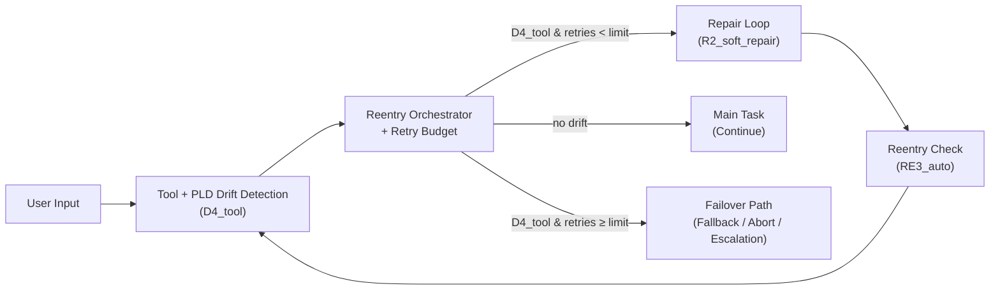

# Failover & Abort Recipe (PLD Integration)

## 1 — Scenario

Repair is not infinite.

A PLD-enabled agent may detect and repair drift correctly, but still fail to recover:

- a tool keeps failing with `D4_tool`
- a retrieval component returns unusable results `D5_information`
- a memory correction `D2_context` never stabilizes

Without **explicit failover semantics**, the system risks:

- infinite repair loops  
- user-visible thrashing (“let me try again…” forever)  
- unclear termination conditions (“did the system _give up_ or _crash_?”)

This recipe shows how to add a **bounded retry budget and controlled failover** path to a PLD runtime loop.

> Goal: move from _“try repair forever”_ to  
> **“try repair N times → then controlled failover/abort.”**

---

## 2 — Failure / Retry Signals → Failover Mapping

We focus on repeated **tool drift** (`D4_tool`) as a concrete example.

| Condition | Drift / Repair History | Failover Policy Decision |
|----------|------------------------|---------------------------|
| `D4_tool` occurs once | No prior failures | Attempt soft repair (`R2_soft_repair`) |
| `D4_tool` occurs again, retries < limit | Prior `D4_tool` + `R2_soft_repair` | Retry with visible repair + reentry |
| `D4_tool` occurs and retries == limit | Local PRDR ≈ 100% on this segment | Route to failover: **fallback / abort / escalation** |
| No drift (`D0_none`) | No errors | Continue normal main task |

**Runtime principle:**

> **“Repair is _bounded_ by policy.**  
> After a fixed number of failed reentries, the agent must switch to a **failover outcome**, not silently continue.”

---

## 3 — Mini Architecture Diagram


This diagram keeps:

- Drift → Repair → Reentry local to the tool component
- Retry budget + Failover routing centralized in orchestration logic

  ---

## Advanced Metrics — Failover & Termination

The following metrics apply when implementing **bounded retry with failover policies**.  
They are relevant when your system includes explicit termination logic, such as in:

- `quickstart/patterns/04_integration_recipes/failover_recipe.md`

These metrics complement the core PLD metrics (PRDR, REI, VRL) by measuring **how and when the system gives up** rather than continuing indefinitely.

---

## 4 — Minimal Runnable Code Example (LangGraph-Compatible)

⚠️ **Implementation Note**  
This recipe demonstrates one possible implementation using **LangGraph (0.2.x+)**.  
PLD itself is **framework-agnostic** — the same failover pattern applies to:

- OpenAI Assistants API  
- AutoGen / CrewAI  
- Rasa / dialogue managers  
- Custom state machines and orchestrators  

Use this as a reference pattern — **not a mandated implementation.**

---

> Dependencies:
> - `langgraph >= 0.2.0`  
> - `Python 3.10+`  
> - **No external tools, APIs, or vector DB required**

```python
"""
Failover & Abort Recipe - Runnable Example
Demonstrates bounded retry with controlled failover in PLD runtime loop.

Requirements:
- langgraph >= 0.2.0
- Python 3.10+

Run:
    python failover_recipe_example.py
"""

from typing import TypedDict, Annotated, Optional, Literal
from langgraph.graph import StateGraph, END
from langgraph.graph.message import add_messages


# -------------------------------------------------------------------------
# State Model
# -------------------------------------------------------------------------

class FailoverState(TypedDict, total=False):
    """
    State for demonstrating:
    - D4_tool drift detection
    - Bounded retry with budget
    - Controlled failover routing
    """
    messages: Annotated[list, add_messages]
    pld_signal: Optional[str]      # D4_tool / D0_none / R* / RE* / OUT*
    retry_count: int               # Number of repair attempts
    retry_limit: int               # Maximum allowed retries
    route: Optional[Literal["main", "repair", "failover"]]
    outcome: Optional[str]         # OUT_success / OUT_fail_fallback
    last_error: Optional[str]      # Error description


# -------------------------------------------------------------------------
# Tool Node (Simulated)
# -------------------------------------------------------------------------

def tool_node(state: FailoverState) -> dict:
    """
    Simulates tool behavior:
    - Input containing 'fail' → D4_tool drift
    - Otherwise → success
    """
    user_msg = state["messages"][-1]["content"].lower()

    if "fail" in user_msg:
        # Simulate failing tool
        return {
            "pld_signal": "D4_tool",
            "last_error": "MockToolError: simulated tool failure",
        }

    # Tool succeeds
    return {
        "pld_signal": "D0_none",
        "outcome": "OUT_success",
        "messages": [
            {"role": "assistant", "content": "Tool executed successfully."}
        ],
    }


# -------------------------------------------------------------------------
# Orchestrator: Routing Decision
# -------------------------------------------------------------------------

def orchestrator_node(state: FailoverState) -> dict:
    """
    Central decision point:
    - D0_none → route to main task
    - D4_tool & retries < limit → route to repair
    - D4_tool & retries >= limit → route to failover
    """
    signal = state.get("pld_signal")
    retries = state.get("retry_count", 0)
    retry_limit = state.get("retry_limit", 3)

    if signal == "D0_none":
        route = "main"
    elif signal == "D4_tool":
        route = "repair" if retries < retry_limit else "failover"
    else:
        # Conservative: unknown signals → failover
        route = "failover"

    return {"route": route}


# -------------------------------------------------------------------------
# Repair Loop
# -------------------------------------------------------------------------

def repair_node(state: FailoverState) -> dict:
    """
    Visible soft repair (R2_soft_repair):
    - Increment retry counter
    - Rewrite input with retry marker
    """
    retries = state.get("retry_count", 0) + 1
    original = state["messages"][-1]["content"]
    rewritten = f"{original} (retry={retries})"

    return {
        "pld_signal": "R2_soft_repair",
        "retry_count": retries,
        "messages": [
            {"role": "assistant", "content": f"Attempting repair #{retries}..."},
            {"role": "user", "content": rewritten},
        ],
    }


def reentry_node(state: FailoverState) -> dict:
    """
    Minimal reentry confirmation (RE3_auto).
    In production: log event, verify conditions, possibly ask user.
    """
    return {
        "pld_signal": "RE3_auto",
    }


# -------------------------------------------------------------------------
# Terminal Nodes
# -------------------------------------------------------------------------

def main_task_node(state: FailoverState) -> dict:
    """Normal continuation after successful tool execution."""
    return {
        "messages": [
            {"role": "assistant", "content": "Resuming main task after tool success."}
        ],
        "outcome": "OUT_success",
    }


def failover_node(state: FailoverState) -> dict:
    """
    Controlled failure path.
    In production: escalate to human, use fallback strategy, create ticket.
    """
    retries = state.get("retry_count", 0)
    last_error = state.get("last_error", "Unknown error")

    fail_msg = (
        f"Tool failed after {retries} repair attempt(s). "
        f"Controlled failover triggered. Last error: {last_error}"
    )

    return {
        "pld_signal": "OUT_fail_fallback",
        "outcome": "OUT_fail_fallback",
        "messages": [
            {"role": "assistant", "content": fail_msg},
            {"role": "assistant", "content": "Escalating to fallback handler."},
        ],
    }


# -------------------------------------------------------------------------
# Graph Construction
# -------------------------------------------------------------------------

def build_graph() -> StateGraph:
    """Construct the failover-enabled PLD graph."""
    graph = StateGraph(FailoverState)

    # Add nodes
    graph.add_node("tool", tool_node)
    graph.add_node("orchestrator", orchestrator_node)
    graph.add_node("repair", repair_node)
    graph.add_node("reentry", reentry_node)
    graph.add_node("main_task", main_task_node)
    graph.add_node("failover", failover_node)

    # Entry point
    graph.set_entry_point("tool")

    # Edges
    graph.add_edge("tool", "orchestrator")

    # Conditional routing from orchestrator
    graph.add_conditional_edges(
        "orchestrator",
        lambda s: s.get("route", "main"),
        {
            "main": "main_task",
            "repair": "repair",
            "failover": "failover",
        },
    )

    # Repair loop: repair → reentry → tool
    graph.add_edge("repair", "reentry")
    graph.add_edge("reentry", "tool")

    # Terminal nodes (no outgoing edges)
    graph.add_edge("main_task", END)
    graph.add_edge("failover", END)

    return graph


# -------------------------------------------------------------------------
# Demo Runner
# -------------------------------------------------------------------------

def demo(message: str, retry_limit: int = 3):
    """Run a single demo scenario."""
    print("\n" + "=" * 70)
    print(f"User Input: {message!r}")
    print(f"Retry Limit: {retry_limit}")
    print("=" * 70)

    # Build and compile graph
    graph = build_graph()
    app = graph.compile()

    # Initial state
    initial_state: FailoverState = {
        "messages": [{"role": "user", "content": message}],
        "retry_limit": retry_limit,
        "retry_count": 0,
    }

    # Execute
    result = app.invoke(initial_state)

    # Display conversation
    print("\nConversation:")
    for msg in result.get("messages", []):
        role = msg.get("role", "unknown")
        content = msg.get("content", "")
        print(f"  {role}: {content}")

    # Display PLD signals
    print("\nPLD Runtime State:")
    print(f"  Signal: {result.get('pld_signal')}")
    print(f"  Retry Count: {result.get('retry_count', 0)}")
    print(f"  Outcome: {result.get('outcome')}")
    if result.get('last_error'):
        print(f"  Last Error: {result.get('last_error')}")


# -------------------------------------------------------------------------
# Main
# -------------------------------------------------------------------------

if __name__ == "__main__":
    print("Failover & Abort Recipe - PLD Runtime Demo")
    print("=" * 70)

    # Case 1: Success (no drift)
    demo("Execute booking tool with valid parameters")

    # Case 2: Failover after 3 retries
    demo("Execute booking tool but make it fail", retry_limit=3)

    # Case 3: Custom retry limit (stricter)
    demo("Execute booking tool but make it fail", retry_limit=1)
    
```

---

## 5 — Recommended Metrics Reference

This recipe directly enables two operational metrics from the PLD metrics cookbook:

From `docs/07_pld_operational_metrics_cookbook.md`:

- **FR (Failover Rate)** — How often failover is triggered  
- **MRBF (Mean Repairs Before Failover)** — Persistence before giving up  

These metrics are useful when determining whether:

- retry limits are too strict or too lenient  
- repair strategies meaningfully improve stability  
- failover paths are acting as safety valves or masking systemic defects  

Refer to the cookbook for interpretation guidance and threshold recommendations.

---
