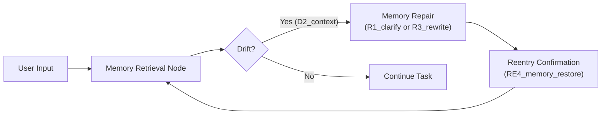

# Memory Alignment Repair Recipe (PLD Integration)

## 1 — Scenario

A user interacts with the agent across multiple turns.  
The agent relies on stored memory (profile/preferences/context notes).  

When memory retrieval leads to outdated, contradictory, or missing context, the system detects drift — commonly **D2_context** — and performs a structured PLD repair and reentry cycle to restore alignment.

This prevents silent degradation, passive hallucinations, or "context wobble."

---

## 2 — Failure Signals → PLD Mapping

| Failure Mode | Example Trigger | PLD Code |
|--------------|----------------|----------|
| Missing stored context | System forgets a preference the user previously stated | `D2_context` |
| Conflicting saved memory | Stored preference contradicts current request | `D2_context` |
| Incorrect memory application | Memory is correct but applied to the wrong turn or task | `D2_context` + metadata |
| Repeated memory override | User keeps correcting stored preference | `D2_context` (repeat indicator → PRDR relevance) |

> Unlike RAG (D5_information) or tool calls (D4_tool), memory drift is relational — it affects the shared state between system and user.

---

## 3 — Mini Architecture Diagram



---

## 4 — Minimal Runnable Code Example (LangGraph-Compatible)

⚠️ **Implementation Note**

This example uses **LangGraph** as one possible implementation approach.

The PLD behavior demonstrated here —  
**Drift → Repair → Reentry → Continue → Outcome** —  
is **framework-neutral** and may be adapted to:

- Assistants API
- AutoGen / CrewAI
- Rasa
- Custom orchestration loops

Use this structure as a reference and adapt based on your agent stack, memory architecture, and UX goals.

> **Dependencies:**  
> - `langgraph`, `langchain-core`  
> - No external memory backend required (mock memory store included)


```python
from langgraph.graph import StateGraph, MessagesState

#
# ---- Mock Memory Store -------------------------------------------------------
#

memory_store = {
    "user_name": "Alex",
    "preferred_units": "metric",
}

def read_memory():
    return memory_store

def write_memory(key, value):
    memory_store[key] = value


#
# ---- State Model --------------------------------------------------------------
#

class MemoryState(MessagesState):
    memory: dict | None = None
    pld_signal: str | None = None
    repair_required: bool | None = None


#
# ---- Runtime Nodes ------------------------------------------------------------
#

def memory_retrieval_node(state: MemoryState):
    """Load memory and compare with latest user request."""
    memory = read_memory()
    user_msg = state["messages"][-1].content.lower()

    if "fahrenheit" in user_msg and memory.get("preferred_units") != "fahrenheit":
        return {
            "pld_signal": "D2_context",
            "memory": memory,
        }

    return {
        "pld_signal": "D0_none",
        "memory": memory,
    }


def detect_drift_node(state: MemoryState):
    if state.get("pld_signal") == "D2_context":
        return {"repair_required": True}
    return {"repair_required": False}


def repair_node(state: MemoryState):
    """Ask user to confirm update (visible repair)."""
    return {
        "pld_signal": "R1_clarify",
        "messages": [
            {"role": "assistant", "content": 
             "It looks like your preference may have changed. Should I update your units to Fahrenheit? (yes/no)"}
        ]
    }


def reentry_node(state: MemoryState):
    """If user confirms, write new memory."""
    last = state["messages"][-1].content.lower()

    if "yes" in last:
        write_memory("preferred_units", "fahrenheit")

        return {
            "pld_signal": "RE4_memory_restore",
            "messages": [
                {"role": "assistant", "content": 
                 "Great — memory updated. Resuming task with Fahrenheit."}
            ]
        }

    return {
        "pld_signal": "RE2_no_change",
        "messages": [
            {"role": "assistant", "content": 
             "Okay — keeping the original preference. Continuing."}
        ]
    }


#
# ---- Build Graph --------------------------------------------------------------
#

graph = StateGraph(MemoryState)

graph.add_node("retrieve", memory_retrieval_node)
graph.add_node("detect", detect_drift_node)
graph.add_node("repair", repair_node)
graph.add_node("reentry", reentry_node)

graph.set_entry_point("retrieve")

graph.add_edge("retrieve", "detect")
graph.add_conditional_edges(
    "detect",
    lambda s: "repair" if s.get("repair_required") else "respond",
    {
        "repair": "repair",
        "respond": "retrieve",
    },
)
graph.add_edge("repair", "reentry")
graph.add_edge("reentry", "retrieve")

app = graph.compile()
```

---

## 5 — Recommended Metrics Reference

From `docs/07_pld_operational_metrics_cookbook.md`:

| Metric | Why It Matters |
|--------|----------------|
| **PRDR** | Detects repeated preference or memory breakage (weak repair). |
| **REI** | Measures cost/benefit of clarification prompts vs. silent memory-sync. |
| **VRL** | Indicates how often memory corrections become visible to the user. |

> Memory drift often has **low-frequency, high-impact** recurrence — PRDR is especially informative.

---

## 6 — Expected Outcome Range

| Behavior | Acceptability |
|----------|--------------|
| Corrected memory in ≤1 turn | Expected |
| No silent overwrite | Required |
| Memory conflicts recur ≥3 turns | Investigate PRDR and repair strategy |
| Wrong memory persists | ❌ PLD failure |

---

## 7 — Optional Variations

| Variation Type | Options |
|----------------|---------|
| Silent repair | Auto-update memory if metadata confidence > threshold |
| Multi-slot memory | Entity-level profiling (name, tone preferences, timezone, domain requirements) |
| Memory expiration | TTL-based “soft reset” with revalidation |
| Persistent profile learning | Long-term preference aggregation |

---

## 8 — Notes for Adaptation

- Memory should **never silently override user intent** — always trace via PLD.
- Treat memory as **shared state**, not a behind-the-scenes optimization.
- Repair should feel like **collaboration**, not interrogation.
- This file is a **reference**, not a fixed prescription.

---

> **Memory drift is subtle — not a crash condition, but a shared state deviation.  
PLD ensures recovery paths are explicit, observable, and structured.**
