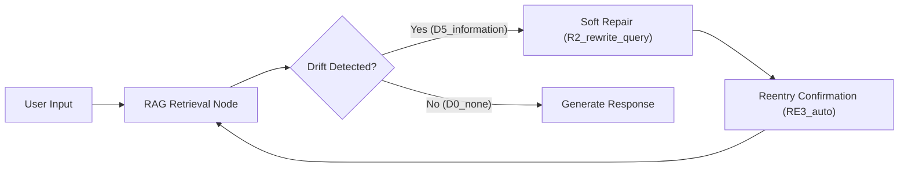

# RAG Repair Recipe (PLD Integration)

## 1 — Scenario

A user asks a question requiring retrieval, but retrieval fails or produces irrelevant content.  
This recipe shows how **PLD detects retrieval failure (D5_information)** and performs structured repair and reentry using LangGraph-compatible execution.

---

## 2 — Failure Signals → PLD Drift Mapping

| Failure Mode | Runtime Symptom | PLD Drift Code |
|--------------|-----------------|----------------|
| Empty retrieval result | `[]`, `None`, missing context | `D5_information` |
| Low-quality or irrelevant documents | Off-topic content, hallucination amplification risk | `D5_information` |
| Repeated re-query with no improvement | Looping requests or vague answers | `D3_flow` + `D5_information` |
| LLM fabricates instead of acknowledging retrieval failure | Unsupported confident response | `D1_instruction` + `D5_information` |

---

## 3 — Mini Architecture Diagram



---

## 4 — Minimal Runnable Code Example (LangGraph-Compatible)

⚠️ **Implementation Note**

This example uses **LangGraph** as one possible implementation approach.

The PLD runtime pattern —  
**Drift → Repair → Reentry → Continue → Outcome** —  
is **framework-neutral** and may be adapted to:

- Assistants API
- AutoGen / CrewAI
- Rasa
- Custom orchestration loops

> **Dependencies:**  
> - `langgraph`, `langchain-core`, `uuid`  
> - No external vector DB required.

```python
from langchain.schema import BaseRetriever, Document
from langgraph.graph import StateGraph, MessagesState
import uuid

#
# ---- Mock Retriever ----------------------------------------------------------
#

class MockRAGRetriever(BaseRetriever):
    """Returns a document only when the query contains 'search'."""
    def _get_relevant_documents(self, query: str):
        if "search" in query.lower():
            return [Document(page_content="This is a mock retrieved document.")]
        return []


retriever = MockRAGRetriever()


#
# ---- State Shape -------------------------------------------------------------
#

class RAGState(MessagesState):
    pld_signal: str | None = None
    retrieved_docs: list | None = None


#
# ---- Runtime Nodes -----------------------------------------------------------
#

def rag_node(state: RAGState):
    query = state["messages"][-1].content
    docs = retriever.invoke(query)

    # Drift detection trigger: Retrieval failure
    if not docs:
        return {
            "pld_signal": "D5_information",
            "retrieved_docs": [],
        }

    return {
        "pld_signal": "D0_none",
        "retrieved_docs": docs,
        "messages": [{"role": "assistant", "content": f"Retrieved: {docs[0].page_content}"}],
    }


def detect_drift_node(state: RAGState):
    if state.get("pld_signal") == "D5_information":
        return {"repair_required": True}
    return {"repair_required": False}


def repair_node(state: RAGState):
    """Soft repair strategy: rewrite query with clearer search intent."""
    last_user_msg = state["messages"][-1].content
    rewritten = f"search: {last_user_msg}"
    return {
        "pld_signal": "R2_soft_repair",
        "messages": [{"role": "assistant", "content": "Trying improved search..."}, 
                     {"role": "user", "content": rewritten}]
    }


def reentry_node(state: RAGState):
    """Confirms reentry; signals next step."""
    return {"pld_signal": "RE3_auto"}


#
# ---- Build Graph -------------------------------------------------------------
#

graph = StateGraph(RAGState)

graph.add_node("rag", rag_node)
graph.add_node("detect", detect_drift_node)
graph.add_node("repair", repair_node)
graph.add_node("reentry", reentry_node)

graph.set_entry_point("rag")

graph.add_edge("rag", "detect")
graph.add_conditional_edges(
    "detect",
    lambda state: "repair" if state.get("repair_required") else "respond",
    {
        "repair": "repair",
        "respond": "rag"
    }
)

graph.add_edge("repair", "reentry")
graph.add_edge("reentry", "rag")

app = graph.compile()


#
# ---- Example Run -------------------------------------------------------------
#

session_id = uuid.uuid4().hex

result = app.invoke({"messages": [{"role": "user", "content": "What is the weather?"}]})

print(result)
```

---

## 5 — Recommended Metrics Reference

From `docs/07_pld_operational_metrics_cookbook.md`:

| Metric | Purpose |
|--------|---------|
| **PRDR (Post-Repair Drift Recurrence)** | Detects whether retrieval repair attempts remain stable across 3–5 turns. |
| **REI (Repair Efficiency Index)** | Measures whether rewriting queries improves retrieval quality relative to cost. |
| **VRL (Visible Repair Load)** | Tracks perceived repair messages such as "Trying improved search...". |

Use these metrics during evaluation or rollout.

---

## 6 — Expected Outcome Range

| Result Type | Acceptable Range |
|------------|------------------|
| Retrieval succeeds after ≤1 soft repair | Expected operational behavior |
| ≥2 repair loops but no result | Acceptable only if followed by controlled fallback |
| Silent hallucination instead of detection | **Not acceptable** (indicates missing D5 handler) |

---

## 7 — Optional Variations

| Variation Category | Options |
|--------------------|---------|
| Retrieval Source | Local FAISS, in-memory list, BM25, Hybrid RAG |
| Repair Strategy | Query rewrite templates, embedding fallback, tool-triggered search |
| Memory | Store retrieval context as episodic memory for future turns |
| UX Style | Visible repair messaging, subtle repair, silent internal retry |

---

## 8 — Notes for Adaptation

- Keep retriever failure as a **first-class runtime signal**, not an exception.
- PLD codes should be **emitted in state**, never buried in logs or prompt text.
- You may modularize repair strategies into a **strategy registry** when scaling.
- Use this recipe as a **reference**, not a mandated pattern.

---

> **This file demonstrates how retrieval failure becomes a detectable drift (`D5_information`) and how PLD ensures structured recovery, confirmation, and stable continuation.**
