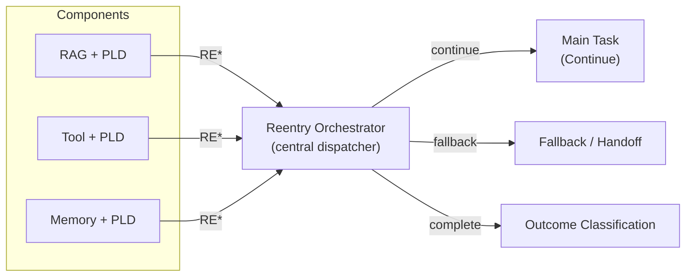

# Reentry Orchestration Recipe (PLD Integration)

## 1 — Scenario

Multiple PLD-enabled components (RAG, tools, memory) each emit structured drift and repair signals.  
This recipe shows how to add a **single Reentry Orchestrator** that interprets `RE*` codes and routes control back to the main task, to fallback, or to another repair path — instead of each component improvising its own reentry logic.

The goal is to keep **Drift → Repair** local, and **Reentry → Continue/Outcome** centralized and observable.

---

## 2 — Failure / Repair Signals → Reentry Mapping

Typical upstream components:

- RAG: `D5_information` → `R2_soft_repair` → `RE3_auto`
- Tool: `D4_tool` → `R2_soft_repair` / `R4_request_clarification` → `RE3_auto`
- Memory: `D2_context` → `R1_clarify` → `RE4_memory_restore`

The Reentry Orchestrator sees only the **reentry-level signals**:

| Upstream Context | Example Reentry Code | Orchestrator Action |
|------------------|----------------------|---------------------|
| RAG repaired, can resume | `RE3_auto` | Route → main task |
| Memory realigned | `RE4_memory_restore` | Route → main task (with updated memory) |
| Reentry not achieved | `RE1_failed` (or equivalent) | Route → fallback / escalation |
| No drift / no repair | `RE0_none` or `phase=none` | Route → continue / outcome |

---

## 3 — Mini Architecture Diagram



---

## 4 — Minimal Runnable Code Example (LangGraph-Compatible)

⚠️ **Implementation Note**

This example demonstrates Reentry Orchestration using **LangGraph**, but the PLD pattern shown here is **framework-neutral**.

The orchestration behavior —  
**Detect → Repair → Reentry → Route → Continue/Outcome** —  
can be adapted to any agent stack, including:

- Assistants API  
- AutoGen / CrewAI  
- Rasa  
- Custom orchestrators / hand-built loops

Use this implementation as a **reference pattern**, not a strict requirement.

> **Dependencies:**  
> - `langgraph`, standard Python  
> - No vector DB, external memory service, or tool registry required.


```python
from langgraph.graph import StateGraph, MessagesState

#
# ---- State Model --------------------------------------------------------------
#

class ReentryState(MessagesState):
    last_drift: str | None = None   # e.g., D5_information / D4_tool / D2_context / D0_none
    pld_phase: str | None = None    # drift / repair / reentry / none
    pld_code: str | None = None     # e.g., RE3_auto / RE4_memory_restore / RE0_none
    route: str | None = None        # continue / fallback / complete


#
# ---- Simulated Upstream Component: Drift Source --------------------------------
#

def drift_source_node(state: ReentryState):
    """
    Simulate where drift came from, based on the user's message.
    - 'search'   → RAG drift (D5_information)
    - 'tool'     → Tool drift (D4_tool)
    - 'memory'   → Memory drift (D2_context)
    - otherwise  → No drift
    """
    user_msg = state["messages"][-1].content.lower()

    if "search" in user_msg:
        drift = "D5_information"
    elif "tool" in user_msg:
        drift = "D4_tool"
    elif "memory" in user_msg:
        drift = "D2_context"
    else:
        drift = "D0_none"

    return {
        "last_drift": drift,
        "pld_phase": "drift" if drift != "D0_none" else "none",
    }


#
# ---- Local Repair Simulation (Per Drift Type) ----------------------------------
#

def repair_node(state: ReentryState):
    """
    Simulate local repair per drift type, and emit a reentry code.
    In a real system this would call RAG/tool/memory repair nodes.
    """
    drift = state.get("last_drift")

    if drift == "D5_information":
        msg = "Repairing retrieval query..."
        reentry = "RE3_auto"
    elif drift == "D4_tool":
        msg = "Repairing tool call..."
        reentry = "RE3_auto"
    elif drift == "D2_context":
        msg = "Repairing memory alignment..."
        reentry = "RE4_memory_restore"
    else:
        msg = "No drift detected. Continuing."
        reentry = "RE0_none"

    return {
        "pld_phase": "reentry" if drift != "D0_none" else "none",
        "pld_code": reentry,
        "messages": [{"role": "assistant", "content": msg}],
    }


#
# ---- Reentry Orchestrator ------------------------------------------------------
#

def reentry_orchestrator_node(state: ReentryState):
    """
    Centralized decision-maker:
    - RE3_auto / RE4_memory_restore → continue main task
    - RE1_failed or unknown        → fallback
    - RE0_none                      → complete (no special routing)
    """
    code = state.get("pld_code")

    if code in ("RE3_auto", "RE4_memory_restore"):
        route = "continue"
    elif code in ("RE1_failed", None):
        route = "fallback"
    else:  # RE0_none or any other neutral code
        route = "complete"

    return {"route": route}


#
# ---- Downstream Nodes ----------------------------------------------------------
#

def main_task_node(state: ReentryState):
    """Represents the 'normal' flow after successful reentry."""
    return {
        "messages": [
            {"role": "assistant", "content": "Resumed main task after reentry."}
        ]
    }


def fallback_node(state: ReentryState):
    """Represents escalation or controlled fallback."""
    return {
        "messages": [
            {"role": "assistant", "content": "Routing to fallback / handoff due to unresolved drift."}
        ]
    }


def outcome_node(state: ReentryState):
    """Terminal node for this simple example."""
    return {
        "messages": [
            {"role": "assistant", "content": "No reentry required. Task complete."}
        ]
    }


#
# ---- Graph Wiring --------------------------------------------------------------
#

graph = StateGraph(ReentryState)

graph.add_node("drift_source", drift_source_node)
graph.add_node("repair", repair_node)
graph.add_node("reentry_orchestrator", reentry_orchestrator_node)
graph.add_node("main_task", main_task_node)
graph.add_node("fallback", fallback_node)
graph.add_node("outcome", outcome_node)

graph.set_entry_point("drift_source")

graph.add_edge("drift_source", "repair")
graph.add_edge("repair", "reentry_orchestrator")

graph.add_conditional_edges(
    "reentry_orchestrator",
    lambda s: s.get("route", "complete"),
    {
        "continue": "main_task",
        "fallback": "fallback",
        "complete": "outcome",
    },
)

app = graph.compile()


#
# ---- Example Runs --------------------------------------------------------------
#

def demo(message: str):
    print(f"\n=== DEMO: {message!r} ===")
    result = app.invoke({"messages": [{"role": "user", "content": message}]})
    for m in result["messages"]:
        print(f"{m['role']}: {m['content']}")
    print("PLD:", {"phase": result.get("pld_phase"), "code": result.get("pld_code"), "route": result.get("route")})

if __name__ == "__main__":
    demo("Please search for hotels.")       # RAG → RE3_auto → continue
    demo("Run this tool for me.")           # Tool → RE3_auto → continue
    demo("Update my temperature memory.")   # Memory → RE4_memory_restore → continue
    demo("Just say hello.")                 # No drift → RE0_none → complete
```

---

## 5 — Recommended Metrics Reference

From `docs/07_pld_operational_metrics_cookbook.md`:

| Metric | How It Connects to Reentry Orchestration |
|--------|------------------------------------------|
| **PRDR** | If the same drift (`D5`, `D4`, `D2`) reappears within 3–5 turns after reentry, your **reentry routing or repair choice is fragile**. |
| **REI** | Compare different reentry strategies (e.g., always fallback vs. auto-continue when `RE3_auto`) by outcome improvement versus cost. |
| **VRL** | Tracks **visible repair + reentry messaging** (e.g., “Resumed main task after reentry”) to balance transparency with UX load. |

Reentry orchestration is where these metrics become **cross-component**:  
You can see which combination of drift type + repair + reentry routing provides the best stability.

---

## 6 — Expected Outcome Range

| Behavior | Interpretation |
|----------|----------------|
| `RE3_auto` / `RE4_memory_restore` → `route=continue` and no new drift within 3–5 turns | Healthy reentry orchestration |
| Frequent `route=fallback` with `RE1_failed` | Repairs or reentry conditions too weak/strict |
| Mixed `D5`, `D4`, `D2` all returning to `route=continue` but high PRDR | Reentry logic present but not addressing root causes |
| Drift without any recorded `RE*` or `route` | ❌ PLD integration gap — reentry orchestration missing |

---

## 7 — Optional Variations

| Variation Type | Example Adjustments |
|----------------|---------------------|
| Routing policy | Only allow `route=continue` when `pld_confidence > threshold` |
| Multi-stage reentry | Chain small reentry steps: `RE2_partial` → `RE3_auto` before full continue |
| Per-drift policy | Use different routes for `D5_information` (safe retry) vs `D4_tool` (limit retries) |
| UX-level reentry | Make reentry messages visible or subtle depending on domain sensitivity |

---

## 8 — Notes for Adaptation

- Keep **Drift + Repair local**, and **Reentry + Routing centralized** for observability.
- Ensure every reentry decision emits machine-readable `RE*` codes and `route` values.
- Treat the Reentry Orchestrator as a **runtime policy layer**, not business logic.
- This recipe is a **reference**, not a mandate — adapt routing rules to your domain risk profile.

---

> **Reentry orchestration is where PLD becomes a system property, not just a node-level hack.  
By centralizing how `RE*` codes are interpreted, you gain stable, observable control over multi-component agent behavior.**
