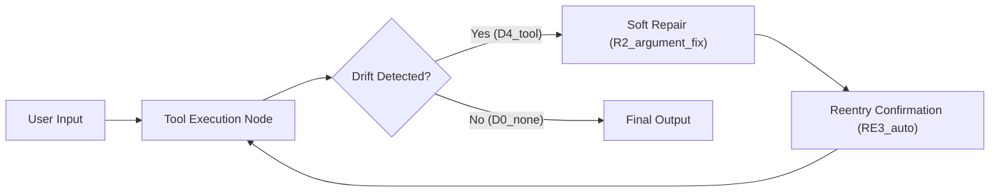

# Tool-Agent Repair Recipe (PLD Integration)

## 1 — Scenario

A user requests an action requiring tool execution (e.g., math, lookup, API call).  
If the tool invocation fails due to missing/invalid arguments or hallucinated tool calls, the system detects the error as **D4_tool** and performs a structured repair and retry flow using the PLD runtime loop.

This recipe demonstrates how PLD prevents silent failure loops, incorrect fixes, and hallucinated tool requests.

---

## 2 — Failure Signals → PLD Drift Mapping

| Failure Mode | Example Condition | Drift Code |
|--------------|------------------|------------|
| Missing required parameter | `"add"` called without numbers | `D4_tool` |
| Invalid parameter type | `"add(apple, 3)"` → cannot parse | `D4_tool` |
| Hallucinated tool call | User request implies `"weather_api()"` but no such tool exists | `D4_tool` |
| Correct tool but wrong intent | `"subtract(5, 10)"` when user meant `"10−5"` | `D4_tool` + optional metadata |

> In PLD, tool execution failure is treated as **process drift**, not user error.

---

## 3 — Mini Architecture Diagram



---

## 4 — Minimal Runnable Code Example (LangGraph-Compatible)

⚠️ **Implementation Note**

This example uses **LangGraph** as one possible implementation approach.

The underlying PLD runtime behavior —  
**Drift → Repair → Reentry → Continue → Outcome** —  
is **framework-neutral** and can be adapted to:

- Assistants API
- AutoGen / CrewAI
- Rasa
- Custom orchestration loops

You may reuse this structure or adapt it based on your existing orchestration layer.

> **Dependencies:**  
> - `langgraph`, `langchain-core`, `uuid`  
> - No external API or tool registry required.


```python
from langgraph.graph import StateGraph, MessagesState
import uuid

#
# ---- Mock Tool ---------------------------------------------------------------
#

class MockCalculatorTool:
    """Simple tool: expects input format 'add X Y'."""
    
    def run(self, command: str) -> str:
        try:
            if not command.startswith("add"):
                raise ValueError("Invalid tool command")

            _, x, y = command.split()
            return str(int(x) + int(y))
        except Exception:
            raise ValueError("ToolError: malformed input")


tool = MockCalculatorTool()


#
# ---- State Model --------------------------------------------------------------
#

class ToolState(MessagesState):
    pld_signal: str | None = None
    tool_result: str | None = None
    repair_required: bool | None = None


#
# ---- Runtime Nodes ------------------------------------------------------------
#

def tool_node(state: ToolState):
    user_msg = state["messages"][-1].content

    try:
        result = tool.run(user_msg)
        return {
            "pld_signal": "D0_none",
            "tool_result": result,
            "messages": [{"role": "assistant", "content": f"Result: {result}"}]
        }

    except Exception:
        return {
            "pld_signal": "D4_tool",
            "tool_result": None,
        }


def detect_drift_node(state: ToolState):
    if state.get("pld_signal") == "D4_tool":
        return {"repair_required": True}
    return {"repair_required": False}


def repair_node(state: ToolState):
    """Visible repair: tell the user what is being corrected."""
    last = state["messages"][-1].content

    rewritten = f"add 1 1" if not last.startswith("add") else f"{last} 1"

    return {
        "pld_signal": "R2_soft_repair",
        "messages": [
            {"role": "assistant", "content": "Fixing tool parameters..."},
            {"role": "user", "content": rewritten},
        ],
    }


def reentry_node(state: ToolState):
    return {"pld_signal": "RE3_auto"}


#
# ---- Build Graph --------------------------------------------------------------
#

graph = StateGraph(ToolState)

graph.add_node("tool", tool_node)
graph.add_node("detect", detect_drift_node)
graph.add_node("repair", repair_node)
graph.add_node("reentry", reentry_node)

graph.set_entry_point("tool")

graph.add_edge("tool", "detect")
graph.add_conditional_edges(
    "detect",
    lambda s: "repair" if s.get("repair_required") else "respond",
    {
        "repair": "repair",
        "respond": "tool",
    },
)
graph.add_edge("repair", "reentry")
graph.add_edge("reentry", "tool")

app = graph.compile()


#
# ---- Example Run --------------------------------------------------------------
#

session_id = uuid.uuid4().hex
result = app.invoke({"messages": [{"role": "user", "content": "add"}]})
print(result)
```

---

## 5 — Recommended Metrics Reference

From `docs/07_pld_operational_metrics_cookbook.md`:

| Metric | Use |
|--------|-----|
| **PRDR** | Detect if repeated tool corrections loop or stabilize. |
| **REI** | Measure value of soft repair vs. fallback/retry cost. |
| **VRL** | Track visible repair messaging frequency (intentional in this recipe). |

> VRL is intentionally non-zero here to demonstrate **PLD observability**.

---

## 6 — Expected Outcome Range

| Outcome | Interpretation |
|---------|---------------|
| Repair succeeds in ≤1 attempt | Expected, optimal |
| ≥2 repair loops needed | Acceptable if followed by structured fallback |
| Silent hallucinated tool output | ❌ Not acceptable |
| Session abandonment without `D4_tool` logging | ❌ PLD integration failure |

---

## 7 — Optional Variations

| Variation Type | Options |
|----------------|---------|
| Retry UX | Silent auto-repair (advanced UX) |
| Multiple tool routing | Add tool registry + tool selection logic |
| Memory integration | Store previous successful formats for adaptive repair |
| Role clarity | Convert repair into question-based clarification (`R4_request_clarification`) |

---

## 8 — Notes for Adaptation

- Treat tool execution errors as **detectable drift**, not user blame.
- Repair paths should be **repeatable** and **classified**, not ad-hoc retries.
- If multiple tools exist, consider adding a **tool-selection drift type**.
- Use this as a **reference implementation**, not a canonical mandate.

---

> **This recipe demonstrates how tool execution failure becomes a detectable drift (`D4_tool`) and how the PLD runtime ensures observable, structured recovery and stable continuation.**
